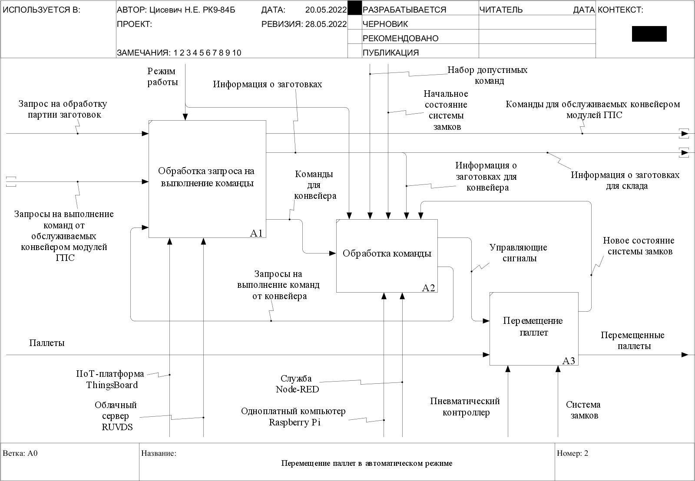

# cloud-based-ring-conveyor-management-system
Мой дипломный проект посвящен разработке облачной системы управления кольцевым конвейером на основе IIoT-платформы ThingsBoard.

Кольцевой конвейер входит в состав транспортно-накопительной подсистемы мини-ГПС «Denford» и взаимодействует с токарным и фрезерным модулями, включающими в себя станки и роботы-манипуляторы, с модулем контроля и складом.

Перед каждым из этих компонентов ГПС на конвейере расположены специальные пневматические замки, позволяющие останавливать паллеты с заготовками, передвигающиеся по ленте конвейера. Движение паллет осуществляется против часовой стрелки. Каждый замок обладает встроенным датчиком, срабатывающим при приближении паллеты.

Основные функции системы управления конвейером – отслеживание перемещения паллет и переключение замков.

Исследуемая система имеет ряд недостатков: 

- ПО имеет закрытый исходный код; 
- Ограниченный набор функций ручного управления; 
- Отсутствие автономного режима работы; 
- Отсутствие возможности удаленного управления.

Одно из возможных решений, лишенное перечисленных недостатков, – система управления, архитектура которой соответствовала бы концепции Промышленного интернета вещей. Промышленный интернет вещей – это система объединенных компьютерных сетей и подключенных промышленных объектов со встроенными датчиками и программным обеспечением для сбора и обмена данными, с возможностью удаленного контроля и управления в автоматическом режиме. 

Рассмотрим архитектуру предлагаемой системы. Она представлена тремя уровнями: устройства, шлюз и платформа Промышленного интернета вещей, или платформа IIoT (сокращение от Industrial Internet of Things).

Устройства – это конвейер и обслуживаемые им модули ГПС.

Шлюз предназначен для обеспечения выхода в сеть Интернет, обработки поступающих с IIoT-платформы сообщений и предварительной подготовки данных (например, показаний датчиков) перед их отправкой на IIoT-платформу.

IIoT-платформа обеспечивает взаимодействие устройств и хранение связанных с ними данных, предоставляет возможность создания операторских панелей для осуществления контроля и мониторинга, отвечает за обработку запросов от оператора и устройств. Платформа располагается на облачном сервере.

В результате концептуального проектирования была определена цель ВКР – разработать облачную систему управления кольцевым конвейером на основе IIoT-платформы. 
Для достижения цели были поставлены следующие задачи:

- Выбрать оптимальные IIoT-решения: IIoT-платформу, инструмент программирования шлюза, протокол передачи данных.
- Выбрать подходящее устройство, способное выступать в роли шлюза, и подключить его к существующей системе; 
- Настроить облачную часть системы:
  - Зарегистрировать на выбранной IIoT-платформе оборудование ГПС;
  - Разработать программу обработки внутриплатформенных событий (событиями, например, являются запросы на выполнение команд);
  - Создать операторские панели для:
    - Ручного управления конвейером;
    - Размещения запросов на изготовление изделий;
    - Оповещения оператора о возникновении нештатных ситуаций;
- Разработать для шлюза программу управления конвейером, обеспечивающую взаимодействие «устройство-облако».

В ходе работы был проведен сравнительный анализ протоколов передачи данных, инструментов программирования шлюза, устройств, способных выступать в роли шлюза, и IIoT-платформ.

Наиболее подходящим вариантом среди протоколов передачи данных, обеспечивающих взаимодействие IIoT-платформы и шлюза, оказался протокол MQTT. В сети на базе протокола MQTT различают 3 объекта:

-	издатель – MQTT-клиент, который при возникновении определенного события передает сообщение с данными брокеру, указывая при этом тему (топик), к которой эти данные относятся.
-	брокер – MQTT-сервер, который принимает информацию от издателей и передает ее соответствующим подписчикам; 
-	подписчик – MQTT-клиент, который после подписки на брокера принимает и обрабатывает сообщения, поступающие в интересующий топик.

Для программирования шлюза было выбрано приложение Node-RED. В качестве ключевой составляющей Node-RED выступает парадигма потокового программирования. Потоковое программирование – это способ описания поведения приложения в виде сети узлов. Каждый узел имеет четкую цель – к нему поступают некоторые данные, он обрабатывает эти данные, а затем передает их на следующий узел. Подключенные узлы при соединении вместе образуют «потоки». Все потоки функционируют параллельно.

К устройству, способному выступать в роли шлюза, предъявлялись такие требования, как совместимость приложения Node-RED с ОС устройства, наличие интерфейса GPIO - интерфейса ввода/вывода для взаимодействия с контроллером конвейера и наличие беспроводного адаптера Wi-Fi. Наиболее подходящим устройством оказался одноплатный компьютер Raspberry Pi 3. 

В качестве платформы промышленного интернета вещей была выбрана платформа ThingsBoard. Предоставляемые ею возможности:

- Регистрация устройств, определение связей между ними;
- Подключение устройств по протоколу MQTT;
- Сбор и визуализация данных с устройств с помощью гибких операторских панелей;
- Хранение данных, связанных с устройствами, в виде атрибутов – пар «ключ-значение»;
- Оповещение оператора о возникновении нештатных ситуаций с помощью тревожных сообщений (алармов), электронных писем и СМС;
- Управление устройствами с помощью технологии RPC (Remote Procedure Calls, удаленные вызовы процедур), позволяющей вызывать функции или процедуры на удаленных устройствах;
- Создание цепочек правил для обработки данных и выполнения действий при происхождении каких-либо событий (например, при поступлении запросов от оператора)

На рисунках ниже представлены функциональные модели перемещения конвейером паллет в ручном и автоматическом режимах. В ручном режиме оператор отправляет запросы на выполнение различных команд. Если запрос не был отклонен, сообщение с командой помещается в MQTT-топик конвейера. Приложение Node-RED, запущенное на Raspberry Pi, получает команду и преобразует ее в определенную последовательность управляющих сигналов, посылаемых на пневматический контроллер конвейера. Контроллер, в свою очередь, определенным образом воздействует на систему замков, открывая или закрывая их, что приводит к перемещению паллеты.

В автоматическом режиме платформа ThingsBoard принимает от оператора запросы на изготовление изделий и на основе содержащихся в запросах данных подготавливает для конвейера информацию об изделиях. При остановке паллеты с заготовкой у какого-либо модуля ГПС, приложение Node-RED, на основании полученной информации об изделии, или инициирует пропуск паллеты через замок, или отправляет на IIoT-платформу запрос на выполнение модулем ГПС какой-либо команды. В этом случае приложение Node-RED ждет, пока модуль не завершит работу, и, получив от него команду, выполняет ее. 

Список команд, используемых при управлении конвейером в ручном режиме и при взаимодействии конвейера и обслуживаемых им модулей ГПС при работе в автономном режиме:

- Команды, предназначенные для конвейера:
  - «run/stop conveyor» – запустить или остановить конвейер.
  - «switch lock» – переключить замок конвейера.
  - «pass pallet» – пропустить паллету через замок.
  - «move pallet» – переместить паллету от одного замка к другому.
  - «handle order» – перемещать паллеты в автоматическом режиме; в качестве параметра команды передается массив JavaScript-объектов с информацией о заготовках (тип изделия, порядок обработки, количество пройденных кругов).
- Команды, предназначенные для других устройств:
  - «start processing» – начать обработку заготовки на фрезерном или токарном станке.
  - «start control» – провести контроль качества.
  - «wait for pallet passing» – ожидать проезда паллеты на второй круг (команда предназначена для склада).
  - «take from conveyor» – забрать паллету на склад.
  - «place on conveyor» – переместить паллеты со склада на конвейер; параметр команды – количество перемещаемых паллет.

Ниже представлены схема подключения Raspberry Pi к существующей системе управления, распиновка Raspberry Pi, а также приведена таблица, в которой содержится информация о назначении пинов.

После регистрации конвейера и остальных модулей ГПС на платформе ThingsBoard были созданы операторские панели: панель для ручного управления конвейером, панель для создания запросов на изготовление изделий и панель, отображающая оповещения о возникновении нештатных ситуаций.

Затем было разработано приложение, которое обрабатывает события, возникающие на платформе ThingsBoard. Приложение представляет собой совокупность взаимосвязанных цепочек правил. 

Сообщения о событиях передаются в так называемую корневую цепочку правил, и, в зависимости от типа события, могут быть перенаправлены в другие цепочки правил. Рассмотрим основные:

- «Server-Side RPC Handler» – проверяет возможность удовлетворения поступающих от оператора запросов на выполнение команд.
- «RPC Redirector» обеспечивает обмен командами между конвейером и остальными модулями ГПС, при работе конвейера в автоматическом режиме;
- «Order Handler» – при поступлении от оператора запроса на изготовление изделий подготавливает для склада и конвейера данные об изделиях. 

С помощью инструмента Node-RED также было разработано приложение и для шлюза, представляющее собой совокупность нескольких параллельно работающих потоков. Рассмотрим некоторые из них:

- «Control Conveyor» отвечает за обработку команды «switch lock» (переключить замок) и «run/stop conveyor» (запустить или остановить конвейер);
- «Pass Pallets» – отвечает за обработку команды «pass pallet» (пропустить паллету через замок);
- «Move Pallets» – отвечает за обработку команды «move pallet» (переместить паллету к указанному модулю ГПС);
- «Act on Readings Update» отвечает за отправку на платформу ThingsBoard показаний датчиков и запросов на выполнение модулями ГПС различных команд, а также обеспечивает выполнение вспомогательных функций при обработке команды «move pallet».

В ходе проделанной работы были решены следующие задачи:

1. Проведено исследование существующей системы управления кольцевым конвейером, входящим в состав мини-ГПС «Denford». 
2. На основе выявленных недостатков сформированы требования к разрабатываемой системе управления конвейером.
3. Найдено решение, удовлетворяющее выдвинутым требованиям – система управления на основе IIoT-технологий.
4. Разработаны архитектура, состав, укрупненная функциональная структура системы.
5. Выбраны следующие IIoT-решения: IIoT-платформа ThingsBoard, инструмент программирования шлюза Node-RED, протокол Интернета вещей MQTT, облачный сервер RUVDS, – а также устройство, выступающее в роли шлюза – Raspberry Pi 3 model B.
6. Разработана модель информационного взаимодействия конвейера и обслуживаемых модулей ГПС, функциональные модели перемещения конвейером паллет в ручном и автоматическом режимах.
7. Разработаны операторские панели для:
   - Ручного управления конвейером;
   - Размещения запросов на изготовление изделий;
   - Оповещения оператора о возникновении нештатных ситуаций.
8. Разработано облачное IIoT-приложение, отвечающее за обработку запросов от оператора и модулей ГПС;
9. Разработано IIoT-приложение для шлюза, выполняющее следующие функции: 
   - Обработка команд и прочих данных, поступающих с платформы ThingsBoard;
   - Отправка на платформу ThingsBoard показаний датчиков и запросов на выполнение модулями ГПС различных команд.

